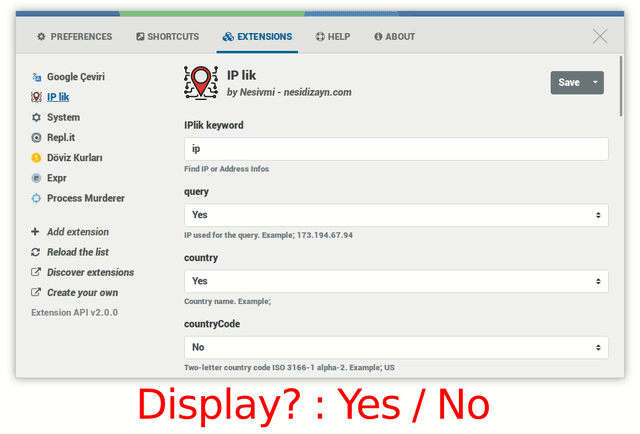

# Ulauncher Iplik (IP Query)

[](https://github.com/nesivmi/ulauncher-translate)

> [IPlik v1.0](https://github.com/nesivmi/ulauncher-iplik)

## Preview


## Requirements

* [Ulauncher](https://github.com/Ulauncher/Ulauncher) 5.0+

## Install

Open ulauncher preferences window -> extensions -> add extension and paste the following url:

```
https://github.com/nesivmi/ulauncher-iplik
```

## Usage

* > ip
* > ip 8.8.8.8
* > ip google.com
* > ip mynet.com
```
```
## Prefrences

* **Display** - Select Yes/No



## Links

* [Api Link ip-api.com](http://ip-api.com/)
* [Ulauncher Extensions](https://ext.ulauncher.io/)
* [Ulauncher 5.0 (Extension API v2.0.0) — Ulauncher 5.0.0 documentation](http://docs.ulauncher.io/en/latest/)
