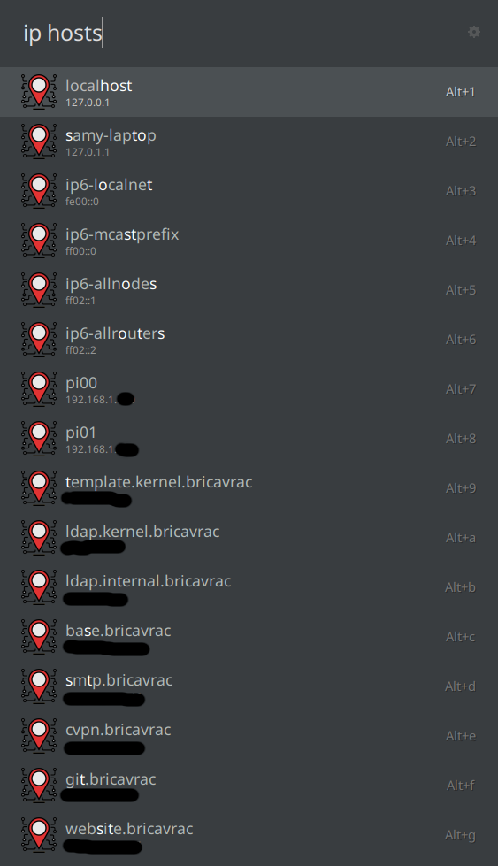
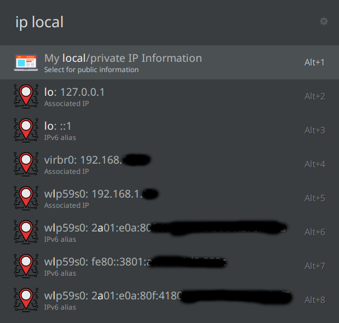

# Ulauncher - IP Analysis

[](https://github.com/manahter/ulauncher-IP-Analysis)

> [IP Analysis v1.0](https://github.com/manahter/ulauncher-IP-Analysis)
```
```
## Preview


**Note!** The limit is 150 requests per minute from an IP address. ( More than enough :)
```
```
## Requirements

* [Ulauncher](https://github.com/Ulauncher/Ulauncher) 5.0+
```
```
## Install

Open ulauncher preferences window -> extensions -> add extension and paste the following url:

```
https://github.com/manahter/ulauncher-IP-Analysis
```
```
```
## Usage

* > ip
* > ip 8.8.8.8
* > ip google.com
* > ip mynet.com
```
```
## Prefrences

* **Display** - Select Yes/No


```
```
## Links

* [Api Link ip-api.com](http://ip-api.com/)
* [Ulauncher Extensions](https://ext.ulauncher.io/)
* [Ulauncher 5.0 (Extension API v2.0.0) — Ulauncher 5.0.0 documentation](http://docs.ulauncher.io/en/latest/)

## Improvments
* Get hosts information - by [@NastuzziSamy](https://github.com/NastuzziSamy)



* Local / Private Information - by [@NastuzziSamy](https://github.com/NastuzziSamy)

